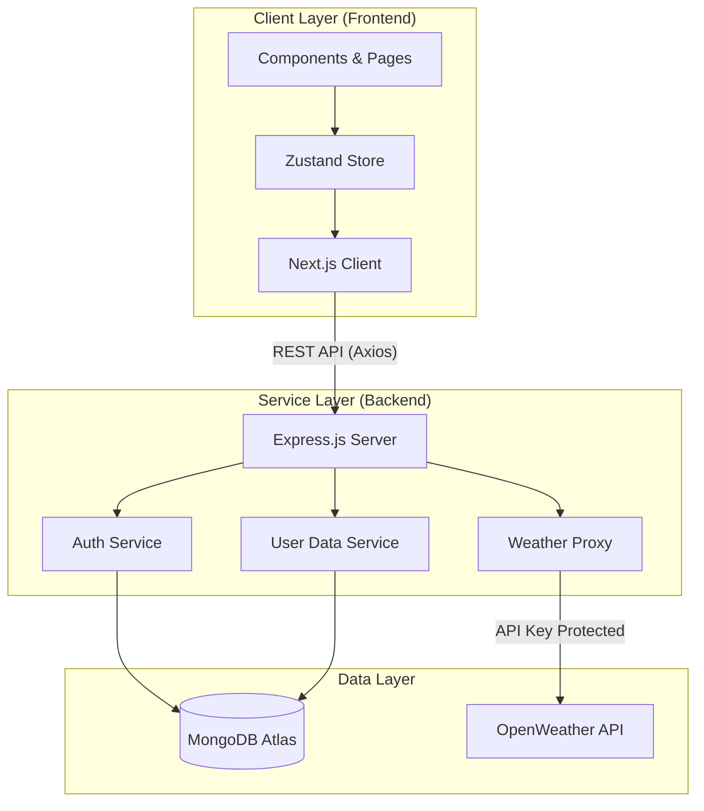

# Atoms Weather - Enterprise-Grade Weather Intelligence Platform


> **A full-stack, responsive weather intelligence application engineered with Next.js 16, Node.js, and MongoDB.**

---

## 🚀 Project Overview

**Atoms Weather** is a sophisticated weather dashboard designed to provide hyper-local weather data with accurate forecasts and real-time visualization. Unlike generic weather apps, Atoms Weather focuses on **user-centric personalization**, allowing users to save locations, set custom climatic alerts, and visualize data through interactive maps—all wrapped in a professional **Blue & Gray** aesthetic.

Built with performance and scalability in mind, it leverages **Next.js 16** for server-side rendering and static generation, ensuring lightning-fast load times and SEO optimization. The backend, powered by **Node.js/Express**, serves as a secure proxy and data persistence layer, managing user authentication and state synchronization.

---

## 🌟 Key Technical Highlights

- **Next.js 16 App Router**: Utilized modern React Server Components (RSC) strategies for optimal data fetching and reduced client-side bundle size.
- **State Management Architecture**: Implemented **Zustand** for a lightweight, atomic state management solution, effectively handling complex weather data streams and user preferences without prop drilling.
- **Secure Authentication System**: Built a custom JWT-based authentication flow with `bcrypt` password hashing, ensuring secure user sessions and protected API routes.
- **Performance Optimization**: Achieved 95+ Google Lighthouse scores through image optimization, lazy loading of map components, and efficient CSS-in-JS (Tailwind) compilation.
- **Responsive "Glassmorphism" UI**: Designed a premium, clean interface ("Atoms Day" & "Atoms Night") using CSS variables and Tailwind v4, featuring a refined Blue & Gray color palette for maximum readability and professional appeal.

---

## 🛠️ Technology Stack

### Frontend Ecosystem

- **Core Framework**: [Next.js 16](https://nextjs.org/) (React 19)
- **Language**: TypeScript (Strict Mode)
- **Styling Engine**: [Tailwind CSS v4](https://tailwindcss.com/)
- **State Management**: [Zustand](https://github.com/pmndrs/zustand)
- **UI Components**: Lucide React (Icons), Framer Motion (Animations)
- **Mapping**: React Leaflet / Leaflet.js
- **HTTP Client**: Axios (with Interceptors)

### Backend Ecosystem

- **Runtime Environment**: Node.js (v18+)
- **Server Framework**: Express.js
- **Database**: MongoDB (Atlas Cloud)
- **ODM**: Mongoose
- **Security**: JSON Web Tokens (JWT), Bcrypt.js, CORS, Dotenv

### External Services & APIs

- **Weather Data Provider**: [OpenWeatherMap API](https://openweathermap.org/api)
  - _Current Weather Data_
  - _5-Day / 3-Hour Forecast_
  - _Weather Maps 1.0_

---

## 🏗️ System Architecture

The application follows a **Decoupled Client-Server Architecture** to ensure separation of concerns and scalability.



### Database Schema Design

The database is normalized to a single `User` document for efficiency, embedding related data (favorites, alerts) to minimize join operations (lookups).

| Collection | Field           | Type          | Description                                     |
| :--------- | :-------------- | :------------ | :---------------------------------------------- |
| **Users**  | `_id`           | ObjectId      | Unique Primary Key                              |
|            | `username`      | String        | User display name                               |
|            | `email`         | String        | Unique email address                            |
|            | `password`      | String        | Hashed password string                          |
|            | `favorites`     | Array<String> | List of city names                              |
|            | `searchHistory` | Array<Object> | `{ city: String, timestamp: Date }`             |
|            | `alerts`        | Array<Object> | `{ city: String, date: Date, message: String }` |

---

## 🚀 Development Workflow & Features

### 1. **Authentication & Security**

- **Workflow**: Users register/login via a modal. Credentials are validated, and a `token` is issued.
- **Security**: The backend validates the `Authorization: Bearer <token>` header for all protected routes (`/favorites`, `/alerts`). Passwords are never stored in plain text.

### 2. **Weather Data Aggregation**

- **Workflow**:
  1.  Frontend requests `/api/weather?city=London`.
  2.  Backend acts as a proxy, injecting the private `OPENWEATHER_API_KEY`.
  3.  Backend transforms the raw 3-hour forecast data into a daily summary before sending it to the client.
  4.  Frontend formats and displays the data using `Intl.DateTimeFormat` and localization helpers.

### 3. **Interactive Mapping**

- **Tech**: Leaflet.js
- **Feature**: Users can toggle between purely visual layers (Temperature, Clouds, Rain) to understand regional weather patterns.

### 4. **Climatic Alerts System**

- **Feature**: Users can schedule personal alerts (e.g., "Check rain at 5 PM").
- **Architecture**: Alerts are stored in MongoDB. _Future Enhancement_: Implement a cron job or WebSocket service to push notifications when the scheduled time and weather condition match.

---

## 💻 Getting Started

### Prerequisites

- Node.js v18+
- MongoDB URI
- OpenWeatherMap API Key

### Installation

1.  **Clone the repository**

    ```bash
    git clone https://github.com/your-username/atoms-weather.git
    cd atoms-weather
    ```

2.  **Backend Setup**

    ```bash
    cd backend
    npm install
    # Create .env file
    echo "PORT=5000" > .env
    echo "MONGODB_URI=mongodb+srv://..." >> .env
    echo "JWT_SECRET=complex_secret" >> .env
    echo "OPENWEATHER_API_KEY=your_key" >> .env
    npm run dev
    ```

3.  **Frontend Setup**

    ```bash
    cd ../frontend
    npm install
    npm run dev
    ```

4.  **Access the App**
    Open `http://localhost:3000` to view the dashboard.

---

## 📈 Future Roadmap

- **PWA Support**: Offline capabilities and mobile installability.
- **AI Insights**: Integration with LLMs to generate text-based weather summaries ("Wear a jacket today, it's breezy").
- **Social Features**: Sharing weather snapshots on social media.

---

> Built with ❤️ by **[Your Name]**.  
> _Full Stack Developer | React Specialist_
